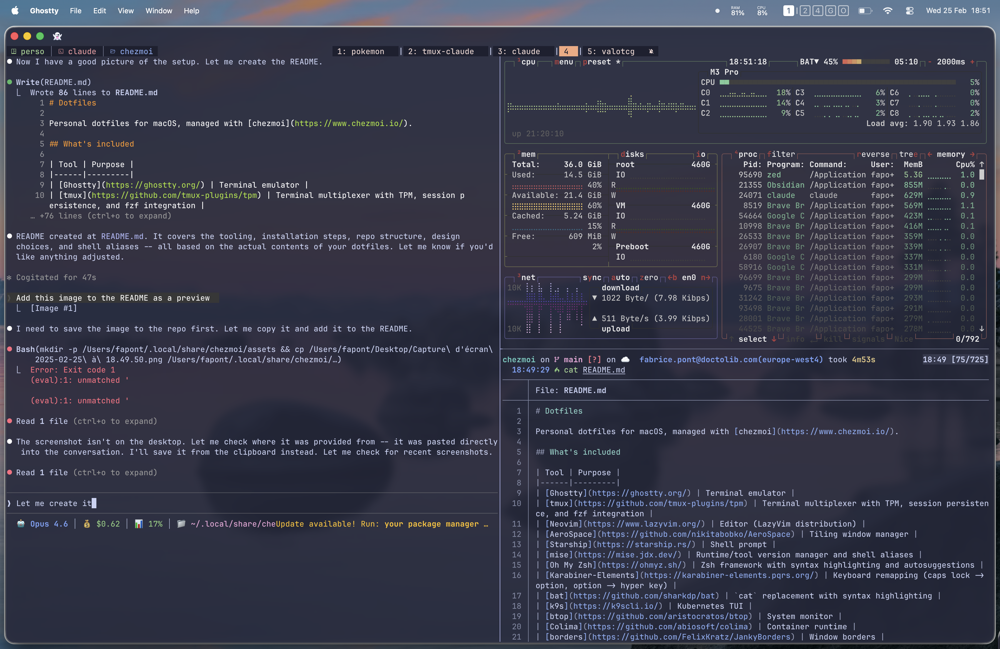

# Dotfiles

Personal dotfiles for macOS, managed with [mise](https://mise.jdx.dev/)'s
declarative [bootstrap](https://mise.jdx.dev/bootstrap.html) feature -- no
Homebrew or chezmoi required, just mise itself.



## What's included

| Tool | Purpose |
|------|---------|
| [Ghostty](https://ghostty.org/) | Terminal emulator |
| [cmux](https://github.com/manaflow-ai/cmux) | Terminal app (tabs/splits/session persistence, built on Ghostty) -- replaces tmux |
| [Neovim](https://www.lazyvim.org/) | Editor (LazyVim distribution) |
| [AeroSpace](https://github.com/nikitabobko/AeroSpace) | Tiling window manager (manual install for now, see below) |
| [Starship](https://starship.rs/) | Shell prompt |
| [mise](https://mise.jdx.dev/) | Runtime/tool version manager, package installs, machine bootstrap |
| [Oh My Zsh](https://ohmyz.sh/) | Zsh framework with syntax highlighting and autosuggestions |
| [Karabiner-Elements](https://karabiner-elements.pqrs.org/) | Keyboard remapping (caps lock -> option, option -> hyper key) |
| [bat](https://github.com/sharkdp/bat) | `cat` replacement with syntax highlighting |
| [k9s](https://k9scli.io/) | Kubernetes TUI |
| [btop](https://github.com/aristocratos/btop) | System monitor |
| [Colima](https://github.com/abiosoft/colima) | Container runtime |
| [LinearMouse](https://linearmouse.app/) | Per-device scroll direction (trackpad vs. mouse) |
| [KeepingYouAwake](https://github.com/newmarcel/KeepingYouAwake) | Menu bar wrapper around `caffeinate` |
| [atuin](https://atuin.sh/) | Shell history (SQLite + encrypted sync) |

**Theme:** Catppuccin Macchiato across terminal, editor, bat, btop, and k9s.

## Prerequisites

- macOS
- [mise](https://mise.jdx.dev/installing-mise.html) -- nothing else. mise's
  `brew`/`brew-cask` backends install Homebrew formulae/casks directly into
  `/opt/homebrew` without needing a real Homebrew install.

```sh
curl https://mise.run | sh
export PATH="$HOME/.local/bin:$PATH"
```

## Installation

On a fresh Mac:

```sh
mise bootstrap --adopt fapont/dotfiles
```

Or from a checkout of this repo (e.g. this is what running it a second time
looks like, since bootstrap is a sequence you can safely re-run):

```sh
git clone https://github.com/fapont/dotfiles.git ~/.dotfiles
cd ~/.dotfiles
mise bootstrap
```

This runs, in order: system packages (brew formulae/casks -- no sudo, no
Homebrew), the `mise-history` watcher service, git repos (Oh My Zsh +
plugins), dotfiles (symlinks app configs into `~/.config`, copies `~/.gitconfig`),
macOS defaults (Dock/Finder/keyboard/trackpad), and finally the CLI tool
versions declared in `mise/config.toml`.

Run it **twice** on a truly fresh machine: the first run creates the symlink
`~/.config/mise/config.toml -> ~/.dotfiles/mise/config.toml`; only after that
symlink exists does mise treat that file's `[dotfiles]` `track` entries and
`[history.*]` settings as *global* config (mise ignores those specific keys
when it only sees them in a project-level file). Everything else applies
correctly on the first run.

### Known gaps (upstream mise bugs, not this repo)

- **AeroSpace**: mise can't yet evaluate this cask's third-party tap Ruby DSL
  (`unsupported cask metadata DSL 'staged_path'`). Install manually:
  `brew install nikitabobko/tap/aerospace` (needs a real Homebrew) or grab a
  release from https://github.com/nikitabobko/AeroSpace/releases. The config
  at `~/.config/aerospace` is already wired up and ready.
- **JetBrains Mono Nerd Font**: mise's font-cask target path rejects
  `$HOME/Library/Fonts` ([jdx/mise#10765](https://github.com/jdx/mise/discussions/10765)).
  Install manually: download `JetBrainsMono.zip` from
  https://github.com/ryanoasis/nerd-fonts/releases and unzip into `~/Library/Fonts`.
- **borders**: builds from source (no bottle for this formula) and needs a
  linker that understands the current macOS SDK's `.tbd` format -- fails with
  `tapi error: malformed file` if your Xcode Command Line Tools are behind
  the SDK. Update CLT (`xcode-select --install`) and re-add
  `"brew:felixkratz/formulae/borders"` to `[bootstrap.packages]` once it builds.
- **Stray root-owned files under `/opt/homebrew`**: if a past `sudo mise ...`
  invocation ran, some paths under the prefix (`Caskroom/.mise.lock`,
  `var/homebrew/locks`, `share/fish`, etc.) can end up owned by root, which
  then blocks *new* installs with `Permission denied (os error 13)`. Fix
  once with `sudo chown -R "$(whoami)":admin /opt/homebrew`; never run `mise
  bootstrap` itself with `sudo`.

## Structure

```
.
├── mise.toml                  # bootstrap recipe: packages, macOS defaults, repos, dotfiles map
├── mise/
│   ├── config.toml            # [tools]/[env]/[shell_alias] + [dotfiles] track + [history.*] -> ~/.config/mise/config.toml
│   └── conf.d/                # work.toml (k8s/Docker/AWS/GCloud), claude.toml
├── config/
│   ├── aerospace/             # Tiling WM config
│   ├── bat/                   # Bat config + Catppuccin theme
│   ├── btop/                  # System monitor config + theme
│   ├── colima/                # Container runtime config
│   ├── ghostty/               # Terminal config
│   ├── k9s/                   # Kubernetes TUI config + plugins + theme
│   ├── karabiner/             # Keyboard remapping rules
│   ├── linearmouse/           # Per-device scroll config
│   └── starship.toml          # Prompt config
├── nvim/                      # Neovim (LazyVim)
├── zprofile                   # PATH for /opt/homebrew (no `brew shellenv` -- no brew binary)
├── gitconfig                  # [user] (pro default) + includeIf ~/Perso -> gitconfig-perso
└── gitconfig-perso            # [user.email] override for ~/Perso/**
```

## Key design choices

- **mise does everything**: package installs (`[bootstrap.packages]`), macOS
  defaults (`[bootstrap.macos.*]`), git repo clones (`[bootstrap.repos]`), and
  dotfile deployment (`[dotfiles]`) are all mise-native. No chezmoi, no
  Homebrew as a separate dependency.
- **symlink vs. copy vs. track**: app configs are `symlink`ed (edit in the
  repo, live immediately). `~/.gitconfig` is `copy`d because `gh auth
  setup-git` and similar tools append machine-local lines to it after
  bootstrap that shouldn't leak into the repo. `~/.zshrc` is `track`ed in
  place (mise versions it via its own history, without moving the file).
- **Dotfiles that save themselves**: the `mise-history` watcher service
  auto-checkpoints tracked files (currently just `~/.zshrc`) so a crash
  between two manual commits doesn't lose config again -- this is what bit
  us with the lost atuin config. `history.sync` starts at `manual`
  (`mise dot save` / `mise dot history`); flip to `sync` in
  `mise/config.toml` once proven out, for automatic periodic push.
- **Per-directory git identity**: `~/Doctolib/**` uses the work email (global
  default), `~/Perso/**` overrides to the personal one via `includeIf`.
- **Modular mise configs**: work tools (k8s, Docker, AWS/GCloud) and Claude
  Code are split into separate `conf.d/` files.

## Shell aliases

Defined in `mise/config.toml`:

| Alias | Command |
|-------|---------|
| `cat` | `bat` |
| `vim` | `nvim` |
| `diff` | `delta` |
| `ls` | `eza` (with icons, git status) |
| `la` | `eza -a` |
| `python` | `python3` |

Additional work aliases in `conf.d/work.toml` (kubectx, docker compose shortcuts, etc.).
