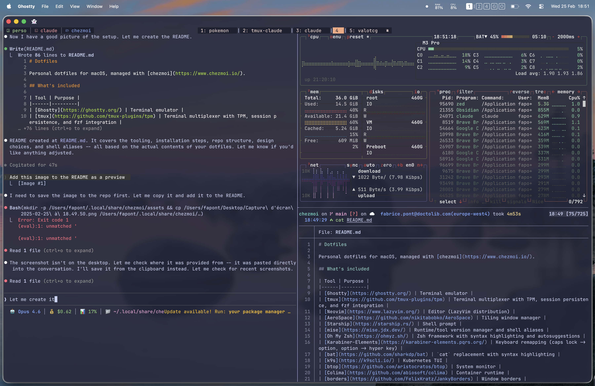

# Dotfiles

Personal macOS dotfiles, bootstrapped entirely by [mise](https://mise.jdx.dev/) -- no Homebrew, no chezmoi.



## Install

```sh
curl -fsSL https://raw.githubusercontent.com/fapont/dotfiles/main/bootstrap.sh | sh
```

Idempotent: installs `mise` if missing, clones (or `git pull --ff-only`) `~/.dotfiles`,
then runs `mise bootstrap` -- packages (via mise's own `brew`/`brew-cask`/`macos-app`
backends, no real Homebrew involved), Oh My Zsh + plugins, symlinked app configs,
`~/.zshrc`, macOS defaults, CLI tool versions. Safe to re-run any time; preview with
`mise bootstrap --dry-run`.

## Structure

```
mise.toml                    # repo clones + the dotfiles map (what goes where)
mise/
  config.toml                 # -> ~/.config/mise/config.toml
  conf.d/
    tools.toml                 # generic CLI versions
    shell.toml                 # aliases + env
    history.toml                # ~/.zshrc tracking
    agents.toml                  # AI/dev-agent CLIs
    work.toml                    # k8s/Docker/AWS/GCloud
    macos.toml                    # macOS packages + system defaults
    obsidian/                     # folder fragment: app + setup-obsidian task + its helper
  tasks/                      # `mise run <name>` scripts (restore-secrets, setup-github-ssh)
config/                        # app configs (git, ghostty, karabiner, btop, k9s, bat, aerospace, colima, linearmouse, starship)
fnox/config.toml               # secrets-as-env-vars
nvim/                           # Neovim (LazyVim)
zprofile
```

`mise/conf.d/` mirrors `~/.config/mise/conf.d/` (each file symlinked with
`symlink-each`), split by domain rather than one big `mise.toml`. Machine-local
fragments (e.g. `doctolib.toml`) can sit next to the links without being tracked.
When a domain needs more than config (scripts, templates, helpers), make it a
**folder fragment** like `conf.d/obsidian/`: a `mise.toml` plus the files it
uses, with the folder as config root (`$MISE_CONFIG_ROOT`) and its
`tasks/` runnable from any directory.

## Notable choices

- App configs are **symlinked** (edit in place, live immediately), git included: the
  shared config is `~/.config/git/config`, while `~/.gitconfig` stays a plain local file
  (read last, so it wins) that catches `git config --global` writes such as
  `gh auth setup-git`. `~/.zshrc` is **tracked** with two marker-delimited edit blocks
  mise owns (Oh My Zsh init, `mise activate`) -- use `mise dot status`/`diff`/`save` for it.
- **Git identity per context**: work email by default, personal email (`config/git/perso`)
  under `~/Perso/`, in this checkout, or in any repo with a `fapont/*` GitHub remote. Add
  a context = one file with a `[user]` block + one `includeIf` in `config/git/config`.
  Commits and tags are SSH-signed with the per-machine key from `setup-github-ssh`.
- **Supply-chain cooldown**: `minimum_release_age = "3d"` -- `latest` never resolves to
  a release younger than 3 days. Pin a version explicitly to bypass it for one tool.
- Secrets live in `fnox/config.toml`. `GH_TOKEN`/`GITHUB_TOKEN` use the `age` provider
  (ciphertext committed, decrypted locally, no network/vault needed) so they're in every
  shell without a Bitwarden session; see "Fresh machine" for restoring the decryption key.

## Known gaps

- **Root-owned files under `/opt/homebrew`**: a past `sudo mise ...` run can leave stray
  root-owned paths that block new installs with `Permission denied`. Fix with
  `sudo chown -R "$(whoami)":admin /opt/homebrew`; never run `mise bootstrap` itself with `sudo`.
- **Hardware-specific entries in `config/karabiner/karabiner.json`**: the "Default
  profile"'s `devices` array pins `simple_modifications` to a specific Apple
  keyboard (`vendor_id = 1452` / `0x5AC`, `product_id = 591` / `0x24F`) and lists
  a Keychron device (`vendor_id = 13364` / `0x3434`, `product_id = 2832` /
  `0xB10`, matching the separate unused "Keychron Q1" profile's name) as a
  pointing device to not ignore. These came from a previous machine's setup and
  may not match any keyboard currently plugged into this one -- harmless if so
  (Karabiner just never matches that device section), but worth pruning by hand
  if/when the old keyboard is confirmed gone for good. The global
  caps-lock/left-option hyper-key remap (used by AeroSpace's `alt-cmd-ctrl-*`
  bindings) is untouched by this and applies regardless of connected keyboard.

## Keeping this up to date

- **New tool/package**: add it to the relevant `conf.d/*.toml`, run `mise bootstrap`, commit.
- **Config drifted locally**: symlinked files edit in place already, just `git add` and
  commit from `~/.dotfiles`. For `~/.zshrc`, use `mise dot status`/`mise dot diff`/`mise dot save`.
- **Before a risky change**: `mise bootstrap --dry-run` to preview.

## Fresh machine

```sh
curl -fsSL https://raw.githubusercontent.com/fapont/dotfiles/main/bootstrap.sh | sh
cd ~/.dotfiles
mise run setup-github-ssh                   # per-machine SSH key, registered with GitHub for auth + commit signing
bw login                                    # the one step that can't be scripted away
mise run restore-secrets                    # unlocks, pulls id_ed25519_age back from Bitwarden
mise run setup-obsidian                     # ~/Obsidian vault + LiveSync, CouchDB creds from the fnox "obsidian" profile
```

Open a new terminal -- `GH_TOKEN`/`GITHUB_TOKEN` are already there. Both tasks are
idempotent, safe to `mise run` again on an already-set-up machine.

## macOS permissions (manual, one-time)

Bootstrap installs each app's `.app` bundle and `macos.toml`'s
`[bootstrap.hooks.post-packages]` opens the background/menu-bar ones once (so
first-run setup happens and macOS shows the permission prompts) -- but
granting a permission prompt is not scriptable. Do it in **System Settings >
Privacy & Security**, then quit and reopen the app (or reboot):

- **Accessibility**: AeroSpace (the window manager itself, plus needed for
  `start-at-login` and the `borders` hook below to run), LinearMouse, AltTab
  (mandatory -- it does nothing without it), Ice, Raycast (hotkeys/snippets),
  Karabiner-Elements (event capture; also covers Input Monitoring on 16.0+,
  no separate grant needed there).
- **Screen Recording**: Raycast (window management, Screen Awareness), AltTab
  (optional, window thumbnails only), Ice (menu bar item images/Ice Bar --
  re-grant after every update since it ships ad-hoc-signed builds), cmux's
  `cmux-cua` helper (only if its Computer Use feature is used).
- **Driver Extension** (Karabiner-Elements only): its `.pkg`-based cask install
  needs `sudo` interactively -- `mise bootstrap` prints the exact
  `sudo installer -pkg ... -target /` command to run by hand if no TTY is
  available (e.g. from an agent/CI context). Afterwards approve
  `Karabiner-DriverKit-VirtualHIDDevice` under **System Settings > General >
  Login Items & Extensions > Driver Extensions**, and allow Karabiner to run
  in the background in the same **Login Items & Extensions** pane. A **reboot
  is required** before the virtual HID driver is fully active and the
  `caps_lock`/`left_option` hyper-key remap in `config/karabiner/karabiner.json`
  starts working end-to-end.
- **"Launch at Login"**: Stats, AltTab, Ice and KeepingYouAwake are started at
  login by LaunchAgents declared in `macos.toml`
  (`~/Library/LaunchAgents/dev.mise.*.plist`). AeroSpace handles it itself
  (`start-at-login = true` in `config/aerospace/aerospace.toml`, once
  Accessibility is granted, and `borders` then starts via its
  `after-startup-command`); Raycast, Bitwarden and LinearMouse register their own
  login item the first time they're opened. Brave has no scriptable option --
  toggle it by hand if wanted. Karabiner-Elements is a different case again:
  there's no login-item toggle or config key -- its installer registers
  LaunchDaemons that auto-start it at every login once it's been run once; quit
  it (or remove the LaunchDaemons) if that's not wanted.
